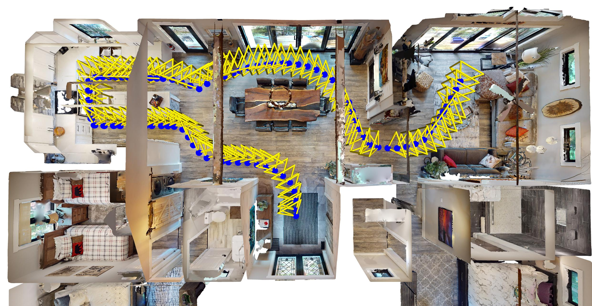

<!-- <p align="center">
  🚧 <b>Work in Progress</b> 🚧
</p> -->

<p align="center">
  <h1 align="center"><ins>ActLoc:</ins><br>Learning to Localize on the Move via Active Viewpoint Selection</h1>
  <p align="center">
    <a href="https://jiajieli7012.github.io/">Jiajie&nbsp;Li*</a>
    ·
    <a href="https://boysun045.github.io/boysun-website/">Boyang&nbsp;Sun*</a>
    ·
    <a href="https://scholar.google.com/citations?user=cZeizisAAAAJ&hl=it">Luca&nbsp;Di&nbsp;Giammarino</a>
    ·
    <a href="https://hermannblum.net/">Hermann&nbsp;Blum</a>
    ·
    <a href="https://www.microsoft.com/en-us/research/people/mapoll/">Marc&nbsp;Pollefeys</a>
  </p>
  <h2 align="center">
  <strong>CoRL 2025</strong> <br>
  <a href="https://www.arxiv.org/abs/2508.20981">Paper</a> |
  <a href="https://boysun045.github.io/ActLoc-Project/"> Webpage</a> |
  <a href="https://huggingface.co/spaces/Jeffreyli7012/ActLocDemo"> Interactive Demo</a> |
  </h2>


## 🔄 Updates
- **Sep 22, 2025**: Check out our [online interactive demo](https://huggingface.co/spaces/Jeffreyli7012/ActLocDemo)!
- **Sep 21, 2025**: Initial code release

---

## 🛠️ Setup
Our code has been tested on a workstation running **Ubuntu 22.04** with an **NVIDIA RTX 4090 (24GB)** GPU and **CUDA 12.4**.  

We recommend creating the environment from the provided `environment.yml` file:

```bash
# create environment
conda env create -f environment.yml

# activate environment
conda activate actloc_env
```

---

## Example Data Download
We provide one example scene from [HM3D](https://aihabitat.org/datasets/hm3d/):
```bash
chmod +x download_example_data.sh && ./download_example_data.sh
```
You can also download the example data from [here](https://drive.google.com/file/d/1QssNeHx9-CzbloKmOe37NyQ0KfTRScwk/view?usp=sharing) and put it in the root folder of this repo to use for demos.

---

## Quick Start

### Single Viewpoint Selection

This script takes an SfM model and a list of waypoints as input, and predicts the optimal camera pose (extrinsic matrix) for each one individually.

```bash
python demo_single.py \
    --sfm-dir ./example_data/reference_sfm \
    --waypoints-file ./example_data/waypoints.txt \
    --checkpoint ./checkpoints/trained_actloc.pth \
    --output-file ./example_data/selected_poses.npz
```

**Expected Output**: This will create a file named `selected_poses.npz` in the `example_data` directory, which contains the calculated poses.


### Multiple Viewpoints Selection with Motion Constraints
To choose viewpoint that balances localization performance and rotation continuity, run:
```bash
python demo_multi.py \
    --sfm-dir ./example_data/reference_sfm \
    --waypoints-file ./example_data/waypoints.txt \
    --checkpoint ./checkpoints/trained_actloc.pth \
    --output-file ./example_data/selected_poses_multi.npz \
    --lamda 0.02
```

### Visualization
To visualize the scene and the prediction results:
```bash
python vis.py \
    --meshfile ./example_data/scene.glb \
    --waypoints-file ./example_data/waypoints.txt \
    --poses-file ./example_data/selected_poses.npz 
```
or:
```bash
python vis.py \
    --meshfile ./example_data/scene.glb \
    --waypoints-file ./example_data/waypoints.txt \
    --poses-file ./example_data/selected_poses_multi.npz 
```
<p align="center">
    <a href=""></a> 
    <br>
</p>

### Render Images from Predicted Poses

To see the observation ath selected poses, use the `selected_poses.npz` file generated to render images from the 3D mesh.

```bash
python capture_predicted_views.py \
    --mesh-file ./example_data/scene.glb \
    --poses-file ./example_data/selected_poses.npz \
    --output-folder ./example_data/best_viewpoint_images
```

**Expected Output**: This will create a new folder named `best_viewpoint_images` containing the rendered images for each successful waypoint. This process might take a while.

---

## 📝 Roadmap
- [x] Single-viewpoint Selection Inference Code Release
- [x] Single-viewpoint Selection Demo Release
- [x] Path Planning Inference Code Release
- [x] Path Planning Demo Release
- [ ] Test Data and Evaluation Script Release
- [ ] Training Data and Training Script Release

---

## Citation
If you find our paper useful, please consider citing:

```bibtex
@misc{li2025actloclearninglocalizeactive,
      title={ActLoc: Learning to Localize on the Move via Active Viewpoint Selection}, 
      author={Jiajie Li and Boyang Sun and Luca Di Giammarino and Hermann Blum and Marc Pollefeys},
      year={2025},
      eprint={2508.20981},
      archivePrefix={arXiv},
      primaryClass={cs.RO},
      url={https://arxiv.org/abs/2508.20981}, 
}
```

